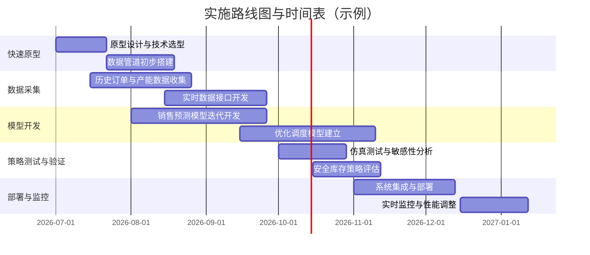

# 敏捷供应链计划优化研究：聚焦直播带货加单与48小时发货

**执行摘要：**本报告针对直播带货场景下突发加单频繁、要求48小时内发货的供应链挑战，提出敏捷计划优化策略。首先定义研究目标：明确48小时发货约束、直播带货订单频次及不确定性特征，以及企业自有产线与外协OEM/ODM产能的类型（若未指定则标注“未指定”）。其次，列举并评估多种需求调研渠道和数据源，包括招聘网站（智联、前程无忧、猎聘）、社交平台（领英、知乎）、产业研究机构（36氪、艾媒、赛迪）、官方统计（国家统计局、行业协会）、企业智库（阿里研究院、京东智联云）等，说明各渠道可获信息类型、检索关键词及优缺点。然后综述学术和行业方法：**销售预测模型**（历史时序、机器学习、因果模型等）；**产能分配优化算法**（整数/混合整数规划、鲁棒/随机优化、在线算法、启发式等）；**安全库存动态策略**（基于服务水平公式、动态S/S‑s模型、预测误差驱动调整等）。引用关键论文与案例说明，如基于XGBoost的销量预测研究、数据驱动鲁棒库存模型等。接着列出若干学生项目方向，每个方向给出研究问题、数据需求、方法建议、预期成果和难度评估；如“直播促销实时需求预测”、“自/外协产能协同调度优化”、“安全库存动态控制策略研究”等。另提出导师/团队匹配策略：推荐利用领英、招聘网站和学术组织寻找供应链计划专家与团队，并给出筛选标准（背景经验、行业专长、项目指导能力）。在实施路线图与时间表方面，绘制甘特图/时间线，规划快速原型、数据采集、模型开发、策略验证、部署监控等步骤。最后分析风险限制：主要包括数据可得性不足、OEM合作能力限制以及实时履约执行的难点。附录提供中文检索关键词和示例查询，以及至少10个可访问的优质资源链接（按优先级排序），供进一步调研。

## 1. 研究目标与问题定义

目标在于**优化供应链计划**以应对直播带货场景下的极端需求波动和严格时效要求。主要问题定义包括：

- **48小时发货约束：**需满足平台或运营商对商家制定的“48小时内发货”服务承诺，实际意味着从消费者下单至商家发出需控制在48小时。这一要求显著缩短了传统生产与履约周期，对生产准备、库存分布和物流安排提出挑战。

- **加单频率与不确定性：**直播带货的销量**波动大且不易预测**。研究发现“直播带货的销售量不确定性大，导致商家无法做供应链计划，备货较为盲目”。同时直播中的订单往往集中爆发，出现**突发性峰值**，打乱常规仓内作业节奏，并导致交付时效不稳定。例如，菜鸟在双11期间发现直播商品销量从日均几千单激增到当天5万甚至10万单。这种高频加单使得准确预测与即时响应成为关键难题。

- **可用产线与OEM/ODM类型：**企业可用的生产资源包括**自有产线**及**外协OEM/ODM产能**。在缺乏具体信息时，默认未指定厂房类型，但可假定可能包括：自有**装配线、定制化生产线**等；以及OEM/ODM合作伙伴（可能在低成本产区）的生产能力。自有产线与外包产能可能具有不同的**产能规模、调整灵活性和交期**。目标是**在48小时发货时限下，协调自有与OEM/ODM产能**，确保及时生产并发货，同时控制成本。图1示意了目标情境：订单需求通过预测模型实时生成，自有工厂和OEM/ODM作为两大生产来源，通过调度模型优化产能分配与发运计划。

> 敏捷供应链计划优化目标示意（直播订单需求→生产调度→48h履约），突出自有产线与外协产能协同。

## 2. 需求调研渠道

为了解行业需求与专家资源，可以利用以下渠道收集信息和寻找导师/团队。表1列举了主要渠道、可获信息类型、检索关键词建议及优缺点比较：

| 平台/渠道      | 信息类型                    | 检索关键词示例            | 优点                                   | 缺点                                   |
|---------------|--------------------------|--------------------------|--------------------------------------|--------------------------------------|
| **智联招聘**  | 大量供应链岗位需求、薪资、技能要求，企业简介 | “供应链 计划 智联招聘” “敏捷 供应链 职位” | 更新频繁、数据丰富，可反映行业人才需求和热度 | 侧重招聘信息，缺少行业报告和市场数据         |
| **前程无忧 (51job)** | 供应链/生产计划相关职位信息   | “供应链 招聘 计划 生产”      | 岗位覆盖广泛、用户基数大                    | 同样偏重招聘角度，缺乏行业统计数据           |
| **猎聘**      | 高端供应链管理职位、专家团队信息 | “供应链 管理 高级 职位”      | 更偏向中高端人才，企业联合校园招聘信息       | 信息量较少，主要集中在大城市               |
| **领英 (LinkedIn)** | 专业网络：供应链从业者、研究者、企业信息 | “Supply Chain Planning” “敏捷 供应链 计划” | 国际化平台，易寻企业专家、团队，发布案例和见解   | 国内内容受限，社交性质较强，部分信息需付费    |
| **知乎**      | 专业问答、案例分享、行业讨论      | “直播 带货 供应链 优化” “敏捷 供应链 定义” | 社区活跃、讨论深入，可见实践案例和痛点         | 回答质量参差，需要甄别专业性；无系统数据分析    |
| **36氪**      | 行业新闻、公司案例、投融资动态    | “直播 电商 供应链” “产能 调度 直播”  | 报道及时、新兴创业公司案例丰富               | 偏新闻视角，较少深入技术细节；需付费查询报告    |
| **艾媒咨询**  | 电商、直播电商行业报告、数据洞察  | “艾媒 直播电商 报告” “电商 数据 分析”   | 发布行业大报告，市场规模、趋势数据；部分免费摘要  | 详细报告收费，深度高但时效性较差               |
| **赛迪顾问/CCID** | 信息通信行业分析、研究报告      | “赛迪 供应链 报告” “CCID 电商 数据”    | 官方背景，聚焦数字经济供应链趋势            | 内容多宏观，专门关注产学研结合，电商专题少见    |
| **国家统计局**| 官方统计数据（电商交易、物流等）  | “电商 交易 统计 数据”        | 权威数据源，覆盖全国宏观统计               | 数据发布具有延迟性，缺乏实时性和场景细节         |
| **行业协会**  | 行业报告、标准、政策解读         | 如“中国物流与采购联合会”“中国电子商会”   | 可获得行业报告和指导性政策文件             | 报告不常公开，需会员或事件参加；内容偏概览       |
| **阿里研究院**| 数字经济与供应链研究报告        | “阿里 供应链 研究院 报告”     | 关注电商供应链，有大数据支撑               | 公开资料少，多为品牌推广                    |
| **京东智联云**| 供应链大数据应用及案例研究        | “京东 智联云 供应链 研究”    | 实践案例和技术文章，时序模型探索（如TimeHF）  | 以开发者社区和案例为主，不提供通用市场数据       |

各渠道互为补充：招聘平台反映市场和人才需求；媒体与报告提供行业现状与案例；官方统计和协会数据提供宏观参考；企业智库提供技术和大数据案例。建议采用混合搜索方式，对关键词按需组合检索，以获取全面信息。例如在智联招聘搜索“敏捷 供应链”，或在36氪、艾媒查找“直播电商 供应链 报告”均可产生线索。

## 3. 学术与行业方法综述

为构建敏捷供应链计划，需要综合运用多种分析与优化方法。主要包括：

- **销售预测模型**：针对直播带货订单的波动性，可采用多样化的预测方法。传统**时间序列模型**（如移动平均、指数平滑、ARIMA、Croston等）擅长捕捉历史规律和季节性，其中Croston方法适用于需求间歇性强的场景。**机器学习模型**（XGBoost、随机森林、神经网络、LSTM等）能融合多维特征（主播属性、价格、促销、历史销量等），提高预测精度。如某研究基于XGBoost构建周销售预测模型，取得R²≈0.985的高精度，并基于此建议动态调整订货量和安全库存。**因果模型**（回归分析、营销组合模型）可评估价格、广告等因素对销量的影响，有助于做出调价、促销决策。业界实践通常将多种方法集成：预测平台可实时输入直播场次、主播等级、商品类目等变量，通过大数据算法输出订单预测，并作为指导备货的依据（如菜鸟预测模型）。

- **产能分配与调度优化**：在有限产能下合理分配自有与OEM/ODM资源，可用**整数/混合整数规划**模型描述（如生产批量、生产线启停决策等）。优化目标通常包括满足需求、降低成本、平衡负荷。考虑需求不确定性，可采用**鲁棒优化**或**随机优化**框架。例如孙月等构建的数据驱动鲁棒库存模型，通过支持向量聚类生成不确定集，证明该方法能有效抑制需求不确定带来的绩效损失。此外，为应对订单实时到达，还可研究**在线算法**（dynamic scheduling）或**启发式算法**（如贪心、遗传算法）以提供近似解。在供应商多元化情况下，产能分配还需考虑OEM生产周期、最小订量、调整成本等实际约束。总之，数学规划提供理论最优解，启发式方法适合实时决策，鲁棒/随机方法强化系统对冲风险的能力。

- **安全库存动态调整**：为应对需求突增与供应波动，设计合适的安全库存策略至关重要。经典公式基于需求和提前期波动计算固定安全库存量（例如 $SS=z\sigma\sqrt{L}$ 等线性统计模型）。但传统静态库存模式在直播电商场景下可能效率低下。现代思路倾向**动态安全库存**：根据未来需求预测动态调整库存天数。SAP案例指出，动态模型核心公式为“目标库存天数×(未来N期总需求/N期天数)”，其特点是“前瞻性计算”、“时间维度导向”和“自适应调整：库存量随需求预测自动伸缩”。例如，当遇到大促时，系统可自动拉高安全库存至对应需求峰值覆盖水平。基于预测误差反馈，可进一步实时修正：若实际需求超出预期，立即追加补货并提升后续安全库存；反之适当回收库存。综上，可采用服务水平驱动策略（设定缺货概率目标）、S/S-s策略（依据实时库存点动态补货）等，结合对比试验找到平衡点。

> **小结：**精准的短期预测（例如结合AI与时序分析）为产能调度提供输入；优化模型则决定产能分配和排程；安全库存策略在整体策略下作为缓冲层。通过多种方法结合，可实现对直播带货订单的快速响应和风险控制。

## 4. 学生可做的项目方向

下表列出针对本课题的若干学生研究项目方向。每项包括研究问题、数据需求、方法建议、预期成果和难度级别，供选题参考。

| 项目方向                 | 研究问题                                     | 数据需求                         | 方法建议                       | 预期成果                                 | 难度 |
|----------------------|-----------------------------------------|------------------------------|----------------------------|--------------------------------------|----|
| **直播订单需求预测**       | 建立实时销量预测模型，评估主播特征与促销对订单的影响             | 历史直播订单数据、主播档案、促销信息、季节事件等 | 时间序列（ARIMA/Croston）、机器学习（XGBoost、LSTM等）、因果分析 | 高精度短期需求预测模型和评估报告；可视化预测仪表盘       | 中高 |
| **产能协同调度优化**       | 在48h发货限制下，优化自有产线与OEM/ODM产能的生产排程           | 产线产能数据、OEM交期和产能、订单需求预测 | 混合整数规划、鲁棒优化、遗传算法等 | 产能分配方案与算法实现；计算实验与敏感性分析         | 高   |
| **安全库存动态管理**      | 研究动态安全库存策略对满足率和成本的影响               | 历史需求波动数据、提前期数据、服务水平要求 | 动态S/S-s策略、预测误差反馈调节   | 动态安全库存调整模型和策略指南；成本/服务水平模拟结果 | 中   |
| **实时调度与再规划**      | 设计在线调度算法，应对直播中途订单变化（加单/取消）         | 订单实时到达数据、产线状态数据             | 在线算法、启发式调度（轮询/优先级等） | 流程图和算法实现，实现快速再调度；仿真测试报告       | 中   |
| **数据分析与可视化平台**   | 搭建数据驱动仪表板，监控订单、库存、产能状态与预测误差    | 订单、库存、生产线、物流等全链路数据         | SQL/BI工具、可视化平台（如Tableau等） | 可视化仪表板原型；系统集成文档              | 中低 |

上述项目方向可以相互结合。例如，需求预测结果可用于产能调度优化项目；安全库存策略可作为产能调度中的缓冲方案。建议首先选取数据可获取、模型复杂度可控的方向快速验证，再逐步深入综合优化。 

## 5. 导师/团队匹配策略

寻找合适的导师或企业团队对于完成此类综合性项目至关重要。推荐渠道和筛选标准包括：

- **渠道**：  
  - **学术渠道**：可搜索国内外高校或研究机构中专注供应链管理与优化的教授或实验室。如中国科技大学、上海交大、清华大学等院校的供应链研究团队。可通过学校官网、学术论文数据库、学术社交网络（ResearchGate、Google Scholar）查找相关领域专家。  
  - **行业社交平台**：领英（LinkedIn）上搜索“供应链规划”或“物流优化”等关键词，筛选具有相关经验的职业人士和团队。知乎专栏、技术社区（如GitHub项目、开发者论坛）也可找到实践导师或合作伙伴。  
  - **招聘渠道**：智联招聘、猎聘等平台上发布项目实习/合作机会，可以吸引供应链、运筹或数据分析背景的人才和导师关注。公司供应链团队负责人招聘信息也可帮助锁定行业专家。  
  - **行业协会与会议**：参加如中国物流与采购联合会（CFLP）或行业峰会，获取专家目录和企业交流。物流、制造业协会通常汇聚资深从业者和研究者，便于寻找愿意指导项目的人选。

- **筛选标准**：  
  - **专业背景**：供应链管理、运筹学、工业工程、物流工程等相关专业博士或资深工程师优先；对直播电商及快消行业有经验者加分。  
  - **行业经验**：有电商或制造业供应链规划实战经验者，如曾主导产能优化、库存管理项目的经理/顾问。曾服务于天猫、京东、菜鸟等电商仓储物流体系的从业者尤佳。  
  - **研究与指导能力**：拥有发表过相关学术论文或白皮书、技术报告的背景；具备一定项目管理经验和愿意带团队/学生实践的意愿。  
  - **项目匹配度**：对敏捷供应链、快速履约等主题兴趣浓厚；了解直播带货业务逻辑；能提供数据或行业资源支持。  

通过上述渠道与标准，可多维度匹配导师或团队资源。例如，一位拥有电商供应链优化经验的教研人员，或一家阿里/京东背景的咨询团队，都可能成为合作伙伴或指导者。

## 6. 实施路线图与时间表

建议采用迭代快速开发和验证方式推进项目。下图为**实施路线图的甘特图示例**，涵盖快速原型、数据采集、模型开发、策略测试与部署等阶段。通过并行任务缩短总周期，并定期迭代评估改进。

**说明：**甘特图中各任务可适当重叠并行：如快速原型和数据采集可同时启动；模型开发在数据初步收集后并行展开；测试验证在模型初具雏形后进行。每阶段结束后进行评审，确保计划及时调整。

## 7. 风险与限制

- **数据可得性**：直播电商订单和生产数据可能分散于平台、企业系统和第三方供应商，获取历史记录及实时数据存在难度。若无真实数据，可考虑公开数据集或模拟生成。  
- **OEM合作约束**：外协工厂可能要求最小订量、固定生产周期或价格，限制快速扩产和灵活分配。须在模型中充分考虑OEM的交期和产能弹性。  
- **实时执行难点**：实时需求变化情况下，调度决策需快速计算，且需要系统化流程支持（自动下单生产、仓储作业调整等）。现有ERP/MES等系统集成难度高，可能导致上线复杂度增加。  
- **预测误差风险**：任何预测模型都有误差，过度依赖结果可能造成缺货或过剩。需设置容错机制（如安全库存），并定期校准模型。  
- **成本与服务平衡**：极端短时发货和频繁调产往往提高成本（加班费、加急物流等），须平衡用户体验与经济性，不宜片面追求低延迟。

## 8. 推荐检索关键词与资源列表

**示例查询语句（中文）：**  
- “直播带货 供应链 优化 48小时 发货”  
- “电商 快速 发货 供应链 协同”  
- “短期 销售 预测 模型 直播 电商”  
- “产能 分配 优化 算法 直播 销售”  
- “安全库存 动态 调整 S S 安全系数”  
- “供应链 敏捷 实时 调度 研究”  
- “OEM 协同 产能 规划 模型”  
- “机器学习 销售 预测 需求 电商”  
- “供应链 项目 课题 实践 电商”  
- “供应链 物流 招聘 导师 匹配 渠道”  

**优质资源链接（按优先级排序）：**  
1. **国家统计局** – 中国官方统计数据入口 [http://www.stats.gov.cn/](http://www.stats.gov.cn/)  
2. **智联招聘** – 招聘信息和行业报告 [https://www.zhaopin.com/](https://www.zhaopin.com/)  
3. **前程无忧 (51Job)** – 招聘岗位与企业资讯 [https://www.51job.com/](https://www.51job.com/)  
4. **猎聘网** – 高端人才和企业招聘 [https://www.liepin.com/](https://www.liepin.com/)  
5. **知乎** – 专业问答与行业讨论 [https://www.zhihu.com/](https://www.zhihu.com/)  
6. **36氪** – 创业及电商行业新闻 [https://36kr.com/](https://36kr.com/)  
7. **艾媒咨询** – 行业调研报告 [http://www.iimedia.cn/](http://www.iimedia.cn/)  
8. **阿里研究院** – 数字经济与供应链研究 [http://www.aliresearch.cn/](http://www.aliresearch.cn/)  
9. **京东智联云** – 供应链技术与模型应用 [https://www.jdcloud.com/](https://www.jdcloud.com/)  
10. **LinkedIn（领英）** – 专业社交平台 [https://www.linkedin.com/](https://www.linkedin.com/)  

上述关键词和渠道可帮助获取需求数据、行业见解、岗位信息及专家资源，为研究提供基础素材。

**参考文献：** (已含在正文引用) 根据公开资料与研究，报道指出直播电商供应链难点如不可预测的销量和集中发货需求；机器学习模型可用于销售预测并指导安全库存调整；鲁棒优化方法能有效应对需求不确定性；安全库存概念及动态策略在波动环境下尤为重要；供应链优化能显著降低成本并保证按时履约。这些信息为本报告分析提供了理论和实践依据。

---

> 版本：v1.0.0（第一版）｜ 更新：2026-09-07 ｜ 项目：直播销量预测的研究（Live-Stream Sales Forecast Research）
